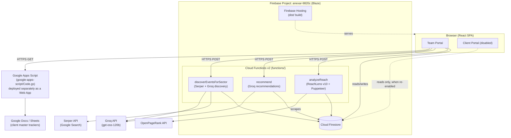
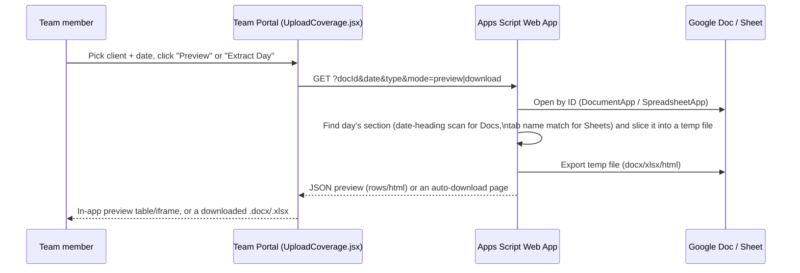
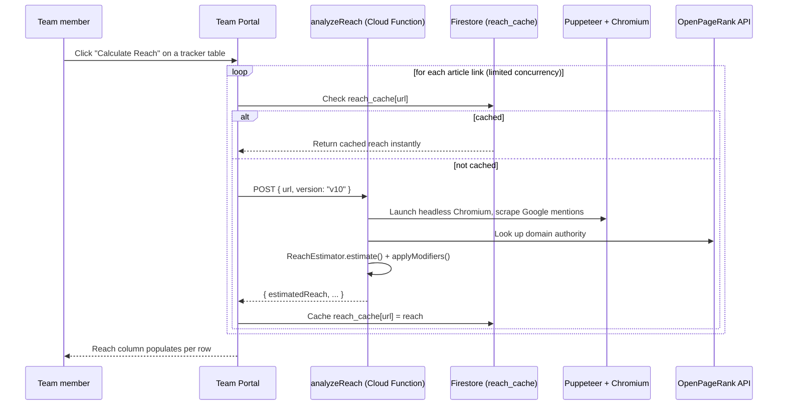
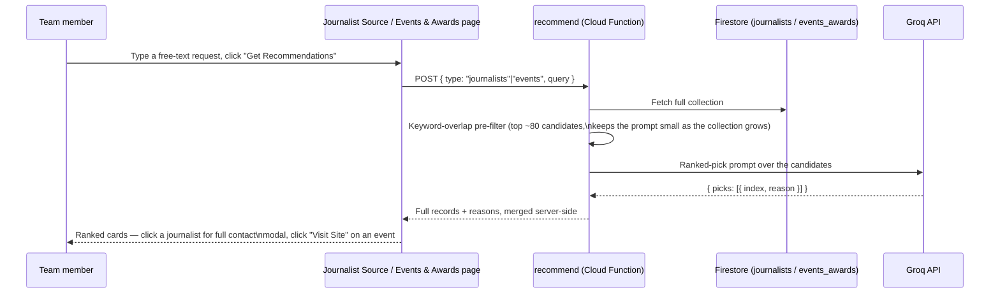
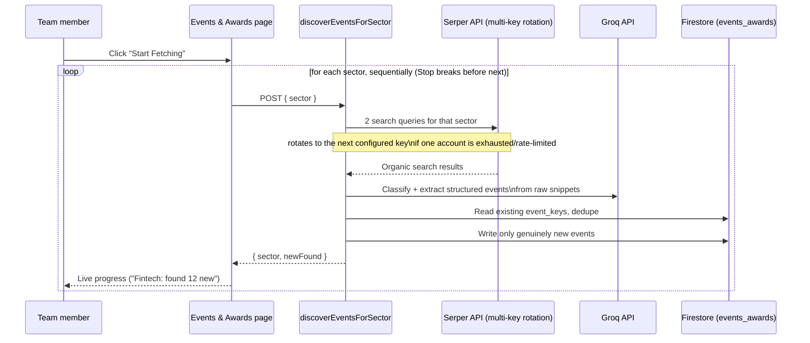

# Anexar — Mavericks Workspace

Internal PR/media-intelligence platform for The Mavericks India. A React (Vite)
single-page app split into a **Team Portal** (employee-facing) and a
**Client Portal** (client-facing, currently disabled — see [Status](#status)),
backed by Firebase (Firestore + Hosting + Cloud Functions), Google Apps
Script, and a handful of external APIs (Groq, Serper, OpenPageRank).

## Table of contents

- [Status](#status)
- [Tech stack](#tech-stack)
- [Architecture](#architecture)
- [Core features & data flows](#core-features--data-flows)
  - [1. Single-day report extraction (Google Docs/Sheets → Team Portal)](#1-single-day-report-extraction-google-docssheets--team-portal)
  - [2. ReachLens v10 — per-article reach scoring](#2-reachlens-v10--per-article-reach-scoring)
  - [3. AI recommendations (journalists & events/awards)](#3-ai-recommendations-journalists--eventsawards)
  - [4. Real sector-wise event/award discovery](#4-real-sector-wise-eventaward-discovery)
- [Database (Firestore collections)](#database-firestore-collections)
- [Project structure](#project-structure)
- [Environment variables](#environment-variables)
- [Local development](#local-development)
- [Deployment](#deployment)
- [Cost notes](#cost-notes)

## Status

| Area | State |
|---|---|
| Team Portal | Live |
| Client Portal | **Temporarily disabled** — route in `src/App.jsx` shows a "Not Available" notice; the original pages are commented out, not deleted |
| Firebase plan | Blaze (pay-as-you-go), usage kept inside the free-tier quota by design |

## Tech stack

- **Frontend**: React 19, Vite 7, Tailwind CSS 4, Framer Motion, Recharts, `xlsx` (SheetJS)
- **Auth**: Google OAuth (`@react-oauth/google`) + Supabase (role/title lookups)
- **Data**: Firebase Firestore (primary datastore), Firebase Hosting (static site)
- **Backend (serverless)**: Firebase Cloud Functions v2 (Node 20) — three functions, see below
- **Backend (scripted)**: Google Apps Script (a separate deployment, not part of Cloud Functions)
- **External APIs**: Groq (LLM inference), Serper (Google Search API), OpenPageRank (domain authority)

## Architecture



## Core features & data flows

### 1. Single-day report extraction (Google Docs/Sheets → Team Portal)

Each client's daily coverage tracker lives as one continuously-growing Google
Doc (dated sections in a single document) or Google Sheet (one tab per day).
Google's own export always returns the *entire* file. `google-apps-script/Code.gs`
is deployed as a standalone Web App that slices out exactly one day and
returns either a downloadable file or a JSON preview.



Once reach is calculated for a previewed day (see below), a **"Download with
Reach"** button builds a client-ready `.xlsx` client-side (via SheetJS),
appending the Reach column and preserving article hyperlinks.

### 2. ReachLens v10 — per-article reach scoring

`reach_lens/` (root) is the canonical ReachLens v10 engine — Puppeteer-based
Google/Reddit mention scraping plus a versioned reach-estimation algorithm.
It's mirrored into `functions/reach_lens/` at deploy time (see
`functions/scripts/sync-reach-lens.js`, wired as a `predeploy` hook in
`firebase.json`) so the root copy stays the single source of truth.



Reach is cached indefinitely once calculated (per the URL, globally across
clients/days) — recalculating the same article is free after the first time.

### 3. AI recommendations (journalists & events/awards)

A single Cloud Function, `recommend`, serves two flows from the Journalist
Source and Events & Awards pages: free-text query → cheap keyword pre-filter
→ Groq (`gpt-oss-120b`) ranks and justifies the picks from real Firestore
records (never inventing details).



### 4. Real sector-wise event/award discovery

Replaces what was previously a cosmetic "fake progress bar" simulation.
`discoverEventsForSector` genuinely searches the web per sector, has Groq
filter out noise and extract structured fields, dedupes against what's
already stored, and writes only new discoveries.



## Database (Firestore collections)

```mermaid
erDiagram
    JOURNALISTS {
        string docId PK
        string name
        string role
        string publication
        string category
        string email
        string phone
        string address
        string bio
        string createdAt
    }

    EVENTS_AWARDS {
        string docId PK
        string event_key
        string event_name
        string event_type
        string sector
        string location
        string status
        string nomination_deadline
        int confidence
        string source_url
        string createdAt
    }

    EVENTS_AWARDS_META {
        string doc_id PK "seed_lock"
        string seededAt
    }

    REACH_CACHE {
        string docId PK "encodeURIComponent(url)"
        string url
        number reach
        string calculatedAt
    }

    PRESS_RELEASES {
        string docId PK
        string client
        string type "excel | docx"
        string fileName
        array headers
        array rows
        string content "docx HTML"
    }

    CLIENT_DOCUMENTS {
        string docId PK
        string client
        string type
        string fileName
        number fileSize
        string uploadedBy
        string createdAt
    }

    GOALS {
        string docId PK
        string client
        string deliverable
        number target
        number achieved
        number progress
        string status
        string period
    }

    KPIS {
        string client_name PK "doc ID"
        number activeCampaigns
        number goalCompletion
    }

    CAMPAIGNS {
        string docId PK
        string client
        string name
        string createdAt
    }

    MEETINGS {
        string docId PK
        string client
        string requestedBy
        string status
    }

    NOTIFICATIONS {
        string docId PK
        string message
        string type
        string createdAt
    }

    EVENTS_AWARDS ||--o{ EVENTS_AWARDS_META : "seeding guarded by"
```



`client_updates`, `client_overall_work`, `thought_leadership`, and `emails`
also exist as lighter-weight collections used by individual pages; omitted
above for brevity. Firestore rules (`firestore.rules`) are fully open
(`allow read, write: if true`) — this is an internal tool behind Google
OAuth, not a public app.

## Project structure

```
├── src/                        # React app (Vite)
│   ├── pages/employee/         # Team Portal pages
│   ├── pages/client/           # Client Portal pages (route disabled)
│   ├── context/                # Auth/User React contexts
│   └── data/                   # Bundled seed datasets (events, journalists)
├── functions/                  # Firebase Cloud Functions v2
│   ├── index.js                # exports: analyzeReach, recommend, discoverEventsForSector
│   ├── recommend.js
│   ├── discoverEvents.js
│   ├── reach_lens/              # generated copy - do not edit directly
│   └── scripts/sync-reach-lens.js
├── reach_lens/                 # Canonical ReachLens v10 engine (edit here)
├── google-apps-script/         # Deployed separately via script.google.com
│   ├── Code.gs
│   └── appsscript.json
├── firebase.json               # Hosting + Functions config (predeploy hook)
└── firestore.rules
```

## Environment variables

Set in `.env` (frontend, `VITE_`-prefixed — bundled into the client, so no
secrets here) and Cloud Functions secrets (server-side only, never exposed):

| Variable | Where | Purpose |
|---|---|---|
| `VITE_FIREBASE_*` | `.env` | Firebase client SDK config |
| `VITE_SUPABASE_*` | `.env` | Supabase client config (role/title lookups) |
| `VITE_APPS_SCRIPT_EXPORT_URL` | `.env` | Deployed Apps Script Web App URL |
| `VITE_REACH_LENS_API_URL` | `.env` | `analyzeReach` Cloud Function URL |
| `VITE_RECOMMEND_API_URL` | `.env` | `recommend` Cloud Function URL |
| `VITE_DISCOVER_EVENTS_API_URL` | `.env` | `discoverEventsForSector` Cloud Function URL |
| `GROQ_API_KEY` | Cloud Functions secret | Groq API key (`recommend`, `discoverEvents`) |
| `SERPER_API_KEYS` | Cloud Functions secret | Comma-separated Serper key(s) — supports multiple accounts as fallback |

## Local development

```bash
npm install
npm run dev              # Vite dev server, http://localhost:4000 (or next free port)
npm run lint
```

Cloud Functions (only needed if changing backend logic):

```bash
cd functions
npm install
```

## Deployment

```bash
npm run build
npx firebase-tools deploy --only hosting,functions
```

First-time secret setup (once per project):

```bash
"YOUR_GROQ_KEY"   | npx firebase-tools functions:secrets:set GROQ_API_KEY --data-file -
"YOUR_SERPER_KEY" | npx firebase-tools functions:secrets:set SERPER_API_KEYS --data-file -
```

## Cost notes

- Firebase plan is **Blaze**, but usage is designed to stay inside the
  standing free monthly quota (2M function invocations, 400K GB-seconds,
  50K Firestore reads/day, etc.) — verified at $0.00 project cost on the
  Firebase Usage & Billing page.
- `analyzeReach` is the heaviest function (bundles Puppeteer + Chromium via
  `@sparticuz/chromium`); `recommend` and `discoverEventsForSector` are
  lightweight (API calls only, no browser).
- Reach scores are cached indefinitely per URL — recalculating an
  already-scored article costs nothing.
- The one hard external quota to watch is **Serper credits**, consumed only
  by `discoverEventsForSector` (2 queries per sector per run).


  satyam kr. singh
