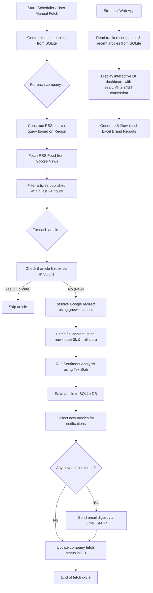
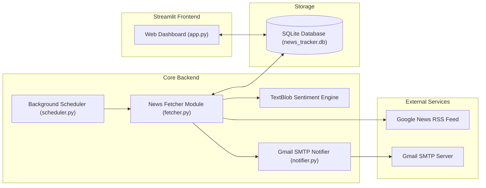

# 📰 Brand-Tracker

An automated, self-hosted web application that monitors news RSS feeds for specific brands and companies in near real-time. It extracts full article text, performs local sentiment analysis, filters by region, deduplicates news using an SQLite database, and sends email notifications.

Developed & Maintained by **Satyam Kr Singh**.

---

## 📊 Visual System Diagrams

### 1. Application Workflow Flowchart
This diagram illustrates the step-by-step logic of the background news fetcher and the interactive Streamlit user interface:



### 2. System Architecture
The relationship between frontend, backend modules, database, and external resources:



### 3. Database Entity-Relationship Diagram (ERD)
The database structure stored in SQLite:

```mermaid
erDiagram
    COMPANIES {
        int id PK
        string name UNIQUE
        string region "Global / India / Both"
        string last_status "Logs of last fetch status"
    }
    ARTICLES {
        int id PK
        int company_id FK
        string title
        string link UNIQUE
        string published_at
        string source
        string summary "Stores extracted full article text"
        string sentiment "Positive / Negative / Neutral"
        string extraction_method "summary / full"
        timestamp created_at
    }
    COMPANIES ||--o{ ARTICLES : tracks
```

---

## 🚀 Key Features

* **Automated Scraper & Scheduler**: Runs in the background (every 5-10 mins) to pull the latest news from Global and regional RSS feeds.
* **Content Extraction & Deduplication**: Fetches full article content dynamically and stores details in SQLite to prevent duplicate alerts.
* **Local Sentiment Analysis**: Classifies article tones as Positive, Negative, or Neutral using TextBlob NLP.
* **Interactive Dashboard**: A clean UI to view, filter, and search articles in Indian Standard Time (IST) and Relative Time.
* **Excel Reports**: Download reports for any brand containing URLs, titles, news agencies, and publication times.
* **Gmail Alerts**: Dispatches automatic email digests when new articles are detected.

---

## 🛠️ Tech Stack

* **Frontend**: Streamlit
* **Database**: SQLite (built-in)
* **Scraping & NLP**: BeautifulSoup4, Newspaper3k, Trafilatura, TextBlob, googlenewsdecoder
* **Task Scheduling**: APScheduler
* **Exporting**: pandas, openpyxl
* **Configuration**: python-dotenv

---

## 📦 Prerequisites

- Python 3.9 or higher.
- A Gmail account with **App Passwords** enabled for sending emails (optional).
  - To generate an app password, go to [Google Account > Security > App Passwords](https://myaccount.google.com/apppasswords).

---

## ⚙️ Setup & Local Execution

### 1. Install Dependencies
```bash
pip install -r requirements.txt
```

### 2. Configure Environment Variables (Optional)
If you want to receive email alerts, create a `.env` file in the root directory based on the `.env.example` file:
```env
GMAIL_USER=your_email@gmail.com
GMAIL_PASS=xxxx xxxx xxxx xxxx
GMAIL_RECEIVER=receiver_email@gmail.com
```
*Note: If these environment variables are missing, the scraper and dashboard will work perfectly, but email notifications will be skipped.*

### 3. Run the Application
```bash
streamlit run app.py
```
The database gets automatically initialized on first run as `news_tracker.db`. The background scheduler will automatically start and check for news updates every 5 minutes.

---

## 👨‍💻 Author & Lead Developer

* **Satyam Kr Singh**
  * Git Branch: `satyam`
  * Repository: [developermavericks/Brand-Tracker](https://github.com/developermavericks/Brand-Tracker)
